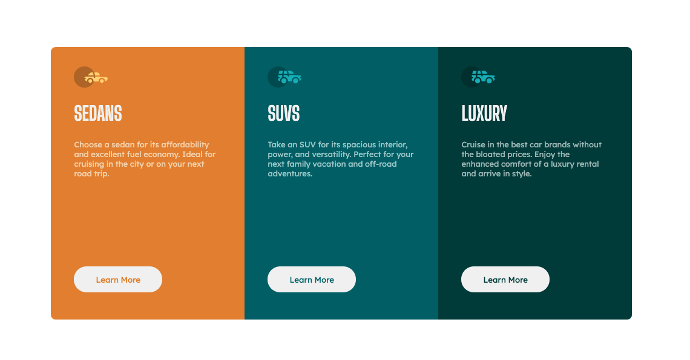

# Frontend Mentor - 3-column preview card component solution

This is a solution to the [3-column preview card component challenge on Frontend Mentor](https://www.frontendmentor.io/challenges/3column-preview-card-component-pH92eAR2-). Frontend Mentor challenges help you improve your coding skills by building realistic projects.

## Table of contents

- [Overview](#overview)
  - [The challenge](#the-challenge)
  - [Screenshot](#screenshot)
  - [Links](#links)
- [My process](#my-process)
  - [Built with](#built-with)
  - [What I learned](#what-i-learned)
  - [Continued development](#continued-development)
- [Author](#author)

## Overview

### The challenge

Users should be able to:

- View the optimal layout depending on their device's screen size
- See hover states for interactive elements

### Screenshot

#### Desktop



#### Phone


### Links

- Github URL: [Github Repo](https://github.com/iamgenechua/3-column-preview-card-component)
- Live Site URL: [Live site URL](https://iamgenechua.github.io/3-column-preview-card-component/)

## My process

### Built with

- Semantic HTML5 markup
- Flexbox
- CSS Grid
- Mobile-first workflow

### What I learned

1. I learnt how to use variables with global scope, as such:

```css
:root {
  --primary-orange: hsl(31, 77%, 52%);
  --primary-dark-cyan: hsl(184, 100%, 22%);
  --primary-very-dark-cyan: hsl(179, 100%, 13%);
  --neutral-transparent-white: hsla(0, 0%, 100%, 0.65);
  --neutral-very-light-gray: hsl(0, 0%, 95%);
}

.button {
  background-color: var(--neutral-very-light-gray);
}
```

2. I learnt how to use :nth-child() pseudoselector

- Also, I learnt how to target nth children of a particular parent, like this:

```css
.wrapper-card > :nth-child(1) {
  background-color: var(--primary-orange);
  border-radius: 8px 8px 0 0;
}

.wrapper-card > :nth-child(2) {
  background-color: var(--primary-dark-cyan);
}
```

### Continued development

I want to learn how to better use pseudoselectors like :nth-child better and more easily.

## Author

- Website - [Gene Chua](https://www.genechua.com)
- Frontend Mentor - [@iamgenechua](https://www.frontendmentor.io/profile/iamgenechua)
